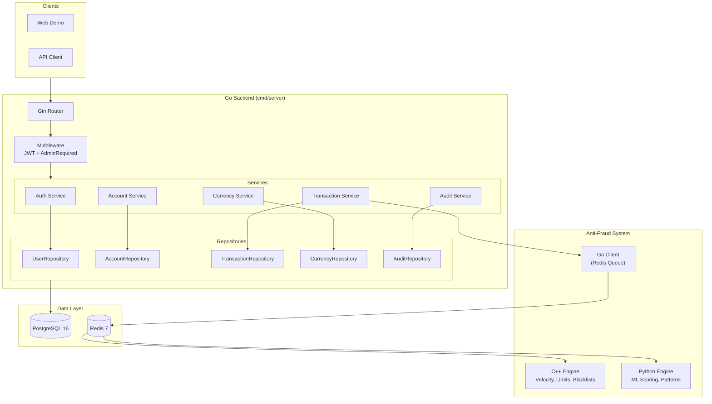
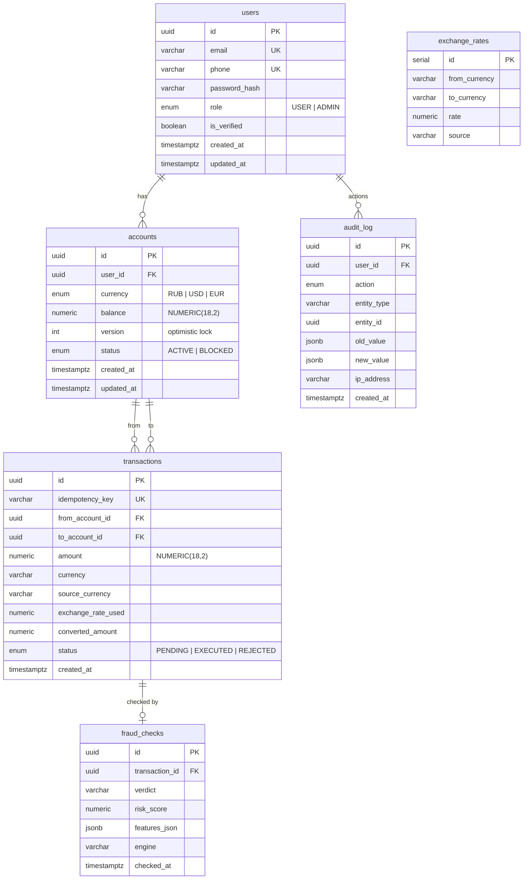
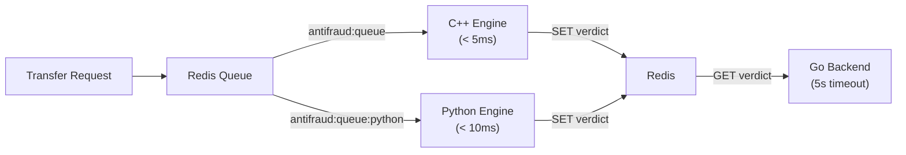

# Architecture

## Overview

QW Pay follows clean architecture principles with strict layer separation: **Handler → Service → Repository**. Each feature module (auth, account, transaction, currency, audit) is self-contained with dependency injection via constructors.

---

## System Architecture



---

## Layer Responsibilities

### Handler (HTTP Layer)

- Validates incoming requests (Gin binding)
- Extracts user context (user_id, role from JWT)
- Calls service methods
- Returns JSON responses with appropriate HTTP status codes

### Service (Business Logic)

- Enforces business rules (balance checks, limits, currency validation)
- Orchestrates multi-step operations (ACID transfers)
- Manages retry logic (optimistic locking)
- Writes audit events

### Repository (Data Access)

- Executes SQL queries against PostgreSQL
- Manages database transactions (BEGIN/COMMIT/ROLLBACK)
- Maps database rows to Go models

---

## Transaction Flow

```mermaid
sequenceDiagram
    participant Client
    participant Handler
    participant AntiFraud
    participant Service
    participant DB as PostgreSQL

    Client->>Handler: POST /api/v1/transactions

    rect rgb(30, 41, 59)
        Note over Handler: Authorization & Ownership
        Handler->>Handler: Verify JWT token
        Handler->>Handler: Check account ownership
    end

    rect rgb(30, 58, 58)
        Note over Handler, AntiFraud: Anti-Fraud Check
        Handler->>AntiFraud: Check(from, to, amount, user)
        AntiFraud->>AntiFraud: C++ velocity + limits
        AntiFraud->>AntiFraud: Python ML scoring
        AntiFraud-->>Handler: Verdict
    end

    alt BLOCKED
        Handler-->>Client: 403 Forbidden
    else APPROVED
        rect rgb(40, 40, 70)
            Note over Service, DB: ACID Transfer with Optimistic Lock Retry
            loop Up to 3 retries
                Service->>DB: BEGIN
                Service->>DB: Check idempotency_key
                Service->>DB: INSERT transaction (PENDING → EXECUTED)
                Service->>DB: UPDATE accounts SET balance = balance - amount<br/>WHERE id = from AND version = X
                alt Optimistic Lock Conflict
                    DB-->>Service: RowsAffected = 0
                    Service->>Service: Re-read accounts
                    Service->>DB: ROLLBACK
                else Success
                    Service->>DB: UPDATE accounts SET balance = balance + amount<br/>WHERE id = to AND version = Y
                    Service->>DB: COMMIT
                end
            end
        end

        rect rgb(40, 50, 30)
            Note over Service: Audit Logging
            Service->>Service: Log TRANSFER_COMPLETED
        end

        Service-->>Client: 200 OK
    end
```



---

## Data Models



---

## Concurrency Patterns

### Optimistic Locking

Every account has a `version` column. On balance updates:

```sql
UPDATE accounts
SET balance = balance - $1, version = version + 1
WHERE id = $2 AND version = $3 AND status = 'ACTIVE'
```

If `RowsAffected() == 0` → version mismatch → re-read and retry (up to 3 times).

### Idempotency

Each transaction carries a unique `idempotency_key` with a UNIQUE constraint. Duplicate requests return the existing result without creating a new transaction.

### ACID Transfers

```sql
BEGIN;
  -- Debit sender (with version check)
  UPDATE accounts SET balance = balance - $1, version = version + 1
  WHERE id = $from AND version = $from_version AND status = 'ACTIVE';

  -- Credit recipient (with version check)
  UPDATE accounts SET balance = balance + $1, version = version + 1
  WHERE id = $to AND version = $to_version AND status = 'ACTIVE';

  -- Record transaction
  INSERT INTO transactions (...) VALUES (...);

COMMIT;
```

---

## Anti-Fraud Architecture



### C++ Engine (Real-time)

- Velocity: max 5 transfers/min, 20/hour
- Amount limits: 500K single, 2M daily
- Blacklists (users, accounts) from Redis sets
- Circular transfer detection
- Round amount detection (structuring)

### Python Engine (ML Scoring)

- Account age risk (< 1h = +40, < 24h = +15)
- Unusual hours (2-5am = +20)
- Amount deviation from average (> 5x = +25)
- Unique recipient count (> 15 = +30)
- Rapid succession (< 10s = +35)
- **Verdict:** risk ≥ 60 → BLOCK

---

## Audit Trail

Every significant event is recorded in the immutable `audit_log` table:

| Action | When |
|--------|------|
| `USER_REGISTERED` | New user signup |
| `USER_VERIFIED` | OTP verification |
| `ACCOUNT_CREATED` | New account opened |
| `ACCOUNT_BLOCKED` | Account blocked (user or admin) |
| `TRANSFER_COMPLETED` | Successful transfer |
| `TRANSFER_BLOCKED_BY_FRAUD` | Anti-fraud rejection |

---

## Infrastructure

### Docker Compose (Development)

```yaml
services:
  db:         PostgreSQL 16 (port 5432)
  redis:      Redis 7 (port 6379)
  app:        Go server (port 8080)
```

### Docker Compose (Full Stack)

```yaml
services:
  db:                 PostgreSQL 16
  redis:              Redis 7
  app:                Go server
  antifraud-cpp:      C++ engine
  antifraud-python:   Python engine
```

### Logging

- Output to stdout (Docker) + `logs/server.log` (development)
- Structured format: timestamp, file, line number
- Anti-fraud verdicts logged with engine, risk score, reason
